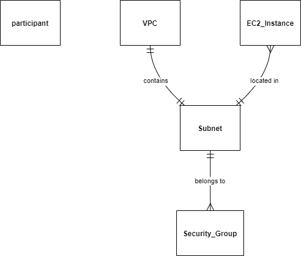

# Satellite Field Monitoring

This project is a Python application that monitors a list of fields using public NASA imagery from the Landsat 8 constellation. The imagery is provided by NASA through the Earth API. The application uses the Earth API to download the imagery and then uses the GDAL library to process the imagery and calculate the NDVI (Normalized Difference Vegetation Index) for each field. The NDVI is then used to determine the health of the field.

## Requirements

Setup the following environment variables:

* `API_KEY` : your apy key for the Earth API
* `BUCKET_NAME`: the name of the S3 bucket where the imagery will be stored
* `AWS_ACCESS_KEY_ID`: your AWS access key id
* `AWS_SECRET_ACCESS_KEY`: your AWS secret access key
* `AWS_REGION`: the AWS region where the S3 bucket is located
* `USE_MOCK_S3`: set to `True` to use a mock S3 server for testing or `False` to use the real S3 server   

These environment variables should be set in a `.env` file in the project root obtained copying the env.example.

The other variables are alreeady set with default values in the `.env` file.

A `field.csv` is already provided in the project root. It contains the list of fields to monitor. The fields are identified by a unique id, a name, a latitude and a longitude.

If you want to use your own list of fields, you can cahnge the `CSV_URL` variable in the `.env` file pointing to your csv.

## Setup

1. Clone the repository.
2. Navigate into the project directory.
3. Create a `.env` file copying the `env.exaple` and filling the missing data as specified in the Requirements above.
4. Go to [satellite_field_monitoring](satellite_field_monitoring) using this command `cd satellite_field_monitoring`.

## Usage

- Use make to run the script container: `make run`

## Docker

You can run the application in a Docker container. Use the included `docker-compose.yml` file to build and run the Docker container.
A very basic version to avoid slow build. 

## Makefile

You can use the included Makefile to build and run the Docker container. The following commands are available:

* `make build`: Build the Docker container.
* `make up`: Run the Docker container.
* `make test`: Run the tests in the Docker container.
* `make down`: Remove the Docker container.
* `make run`: Build and run the Docker container.

# Cloud Arquitecture

1. AWS Lambda: This is the core of the architecture. it use a Python-based AWS Lambda function to download the image from the external URL. Lambda is a serverless     computing service that runs your code in response to events and automatically manages the underlying compute resources for you.

2. Amazon S3: After retrieving the image, the Lambda function would then upload it to an Amazon S3 bucket. S3 (Simple Storage Service) is an object storage service that      offers industry-leading scalability, data availability, security, and performance.

3. Amazon CloudWatch Events: To ensure this process happens on a daily basis, is needed Amazon EventBridge. Here you can set a signal to run the Lambda every 24h for example.

4. IAM Role: Needed with the necessary permissions attached to the Lambda function. This role would need permissions to access the S3 bucket (to store the image) and to execute the Lambda function.

